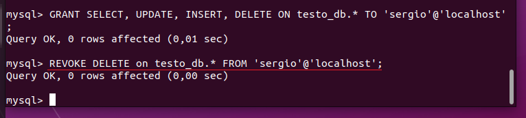

## Database Administration

### PART 1
1. DownloadMySQL server for your OS on VM.
2. Install MySQL server on VM.
3. Select a subject area and describe the database schema, (minimum 3 tables)
4. Create a database on the server through the console.
5. Fill in tables.
6. Construct and execute SELECT operator with WHERE, GROUP BY and ORDER BY.
7. Execute other different SQL queries DDL, DML, DCL.
8. Create a database of new users with different privileges. Connect to the databaseas a new user and verify that the privileges allow or deny certain actions.
9. Make a selection from the main table DB MySQL.

<em>Check install</em>

<em>Set password</em>

$ sudo mysql_secure_installation

<em>Set remote user for Mysql Workbench</em>

<em>Allow remote connections</em>

$ sudo mysql -u root -p

mysql> CREATE DATABAS testo_db;

mysql> USE testo_db;

mysql> CREATE TABLE pizza(yeast VARCHAR(50) NOT NULL, water INT NOT NULL, oil VARCHAR(50) NOT NULL, powder VARCHAR(50) NOT NULL);

mysql> CREATE TABLE donut(yeast VARCHAR(50) NOT NULL, sugar INT NOT NULL, salt INT NOT NULL, water INT NOT NULL, powder VARCHAR(50) NOT NULL);

mysql> CREATE TABLE pancake(eggs INT NOT NULL, sugar INT NOT NULL, salt INT NOT NULL, milk INT NOT NULL, powder VARCHAR(50) NOT NULL), oil VARCHAR(50) NOT NULL;
 
mysql> SHOW DATABASES;

<em>Database schema in MySQL Workbench</em>

<em>Fill tables</em>

mysql> INSERT INTO pizza VALUE("one tea spoon", 200, "one spoon", "500");

mysql> INSERT INTO pancake VALUE(2, 200, 1, 500, "one cup", "one spoon");

mysql> INSERT INTO donut VALUE("two eggs", 200, 1, 500, "one cup", "one spoon");

<em>WHERE, GROUP BY and ORDER BY</em>

<em> DDL - Data Definition Language example: </em>

<em> DML - Data Manipulation Language example: </em>

<em> DCL - Data Control Language example: </em>

<em>Create a database of new users with different privileges. Connect to the databaseas a new user and verify that the privileges allow or deny certain actions.</em>

Create users.

Grants for users.

Deny DELETE command for user test2.

<em>Make a selection from the main table DB MySQL.</em>

### PART 2

<em>Backup database</em>

<em>Delete the table</em>

<em>Restore one table from backup</em>

<em>Transfer your local database to RDS AWS.</em>

<em>Create AWS Database</em>

<em>Test connection to AWS Database</em>

<em>Import local db to RDS AWS</em>

<em>Execute SELECT operator</em>

<em>Create the dump</em> 

### PART 3 – MongoDB

<em>Create a database. Use the use command to connect to a new database</em> 

<em>Create a collection. Use db.createCollection to create a collection</em>

<em>Create some documents. Insert a couple of documents into collection</em>

<em>Use find() to list documentsout.</em>

