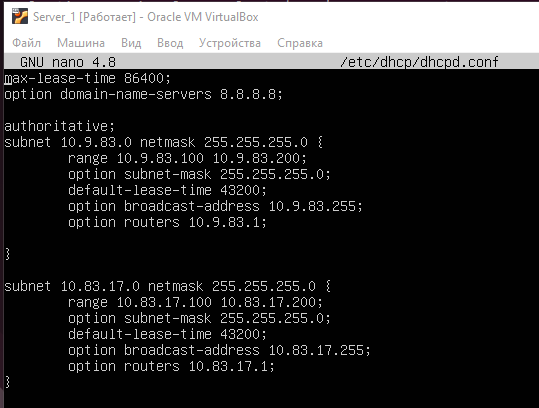

## Linux Networking

On Server_1 configure static addresses on all interfaces.

On Server_1, configure a DHCP service that will configure Int1 Client_1 and Client_2 addresses

Configure /etc/dhcp/dhcpd.conf

Configure /etc/default/isc-dhcp-server

Enable ip forwarding data between local interfaces:

<strong>echo 1 > /proc/sys/net/ipv4/ip_forward </strong>

Ping packet send to default route throuth Server_1 (10.83.17.1)  via enp0s8 interface. Reach Clien_2 (10.9.83.100) and go back throuth Server_1 (10.83.17.1) via enp0s3 interface.

Set static route on router 192.168.1.1 for internet access from Client_1 and Client_2 hosts.

Set Net4 LAN:

Assign two IP addresses on the lo virtual interface Client_1 host:

Configure routing 172.17.27.0/24 throuth Server_1.

On Client_2 host set static route throuth net4

<strong>sudo ip route add 172.17.27.0/24 via 10.9.83.1</strong>

On Server_1 host set static route throuth net4

<strong>sudo ip route add 172.17.27.0/24 via 10.83.17.1</strong>

Configure routing 172.17.37.0/24 throuth Net4.

On Client_2 host set static route throuth net4

<strong>sudo ip route add 172.17.37.0/24 via 172.16.17.2</strong>

On Client_1 host set static route throuth net4

<strong>sudo ip route add 172.17.37.0/24 via 172.16.17.1</strong>

Calculate the summarizing addresses 172.17.27.1 and 172.17.37.1, with the mask being as large as possible.

For 172.17.27.1 and 172.17.37.1
<pre>
Network Address	Usable Host Range		Broadcast Address:
172.17.0.0	172.17.0.1 - 172.17.63.254	172.17.63.255

172.17.0.0   	255.255.192.0/18</pre>

On Server_1 host set static route 

<strong>sudo ip route add 172.17.0.0/18 via 10.83.17.1</strong>

Set ssh server on Server_1

<strong>sudo apt install openssh-server</strong>

Connect to Server_1 from Client_1

Connect to Server_1 from Client_2

Set ssh server on Client_1

<strong>sudo apt install openssh-server</strong>

Set ssh server on Client_2

<strong>sudo apt install openssh-server</strong>

Connect to Client_2 from Client_1

Connect to Client_1 from Client_2

Server_1 firewall:

<strong>sudo ufw enable</strong>

Allow ssh connection from Client_1

<strong>sudo ufw allow from 10.83.17.100</strong>

Ping reject from Client2 to 172.17.37.1

Add rule to /etc/ufw/before.rules

Set NAT on Server_1 for 10.83.17.0/24 and 10.9.83.0/24

Enable fowarding 

Edit /etc/ufw/before.rules

Ping from Client_1

Mtr from Client_2

