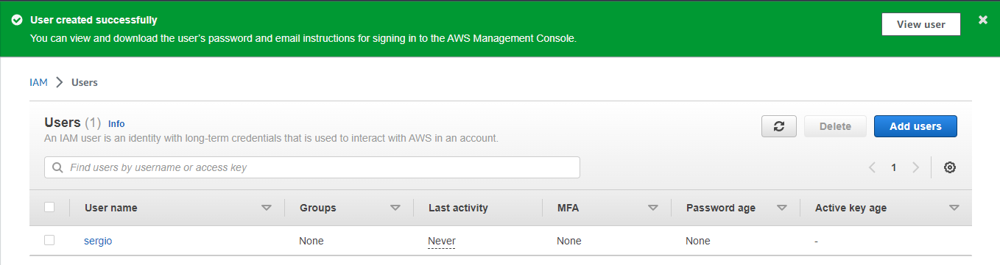

## Virtualization and Cloud Basic

Review Getting Started with Amazon EC2. Log Into Your AWS Account, Launch, Configure, Connect and Terminate Your Instance. Do not use Amazon Lightsail. It is recommended to use the t2 or t3.micro instance and the CentOS operating system.

<em>Create and run instance.</em>

<em>Connetct to instance.</em>

<em>Reset pem key in Windows OS</em>
<em>Set permissions</em>

icacls .\frankfurt.pem /reset
icacls .\frankfurt.pem /inheritance:r
icacls .\frankfurt.pem /grant:r "$($env:USERNAME):(R)"

<em>Delete instanse.</em>

<em>Create a snapshot of instance.</em>

<em>Create and attach a Disk_D (EBS) to nstance.</em>

<em>Create and save some file on Disk_D</em>

<em>Deattach volume</em>

<em>Launch the second instance from backup.</em>

<em>Attach disk_D to the new instance</em>

<em>Free register the domain name*.PP.UA</em>

<em>Create domain  name. Ping instance</em>

<em>Launch and configure a WordPress instance with Amazon Lightsail</em>

<em>Create bucket, upload files</em>

<em>Create user</em>

<em>Create access key</em>

<em>Configure CLI AWS and upload any files to S3.</em>

<em>Deploy Docker Containers on Amazon Elastic Container Service (Amazon  ECS)</em>

<em>Create docker image</em>

<em>Test</em>

<em>AWS Lambda</em>

<em>Create a static website on Amazon S3</em>

<em>[EPAM Cloud&DevOps Fundamentals Autumn 2022](http://srg6rt-botnikov-1.s3-website.eu-central-1.amazonaws.com/)</em>